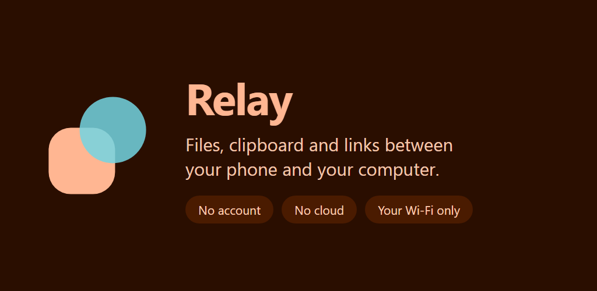
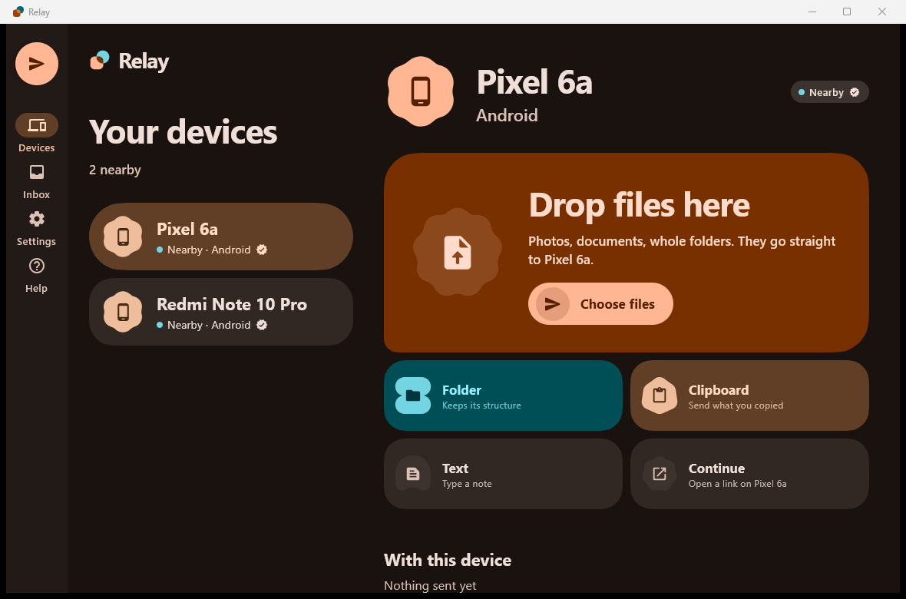
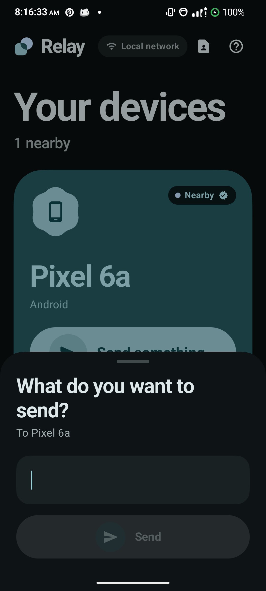
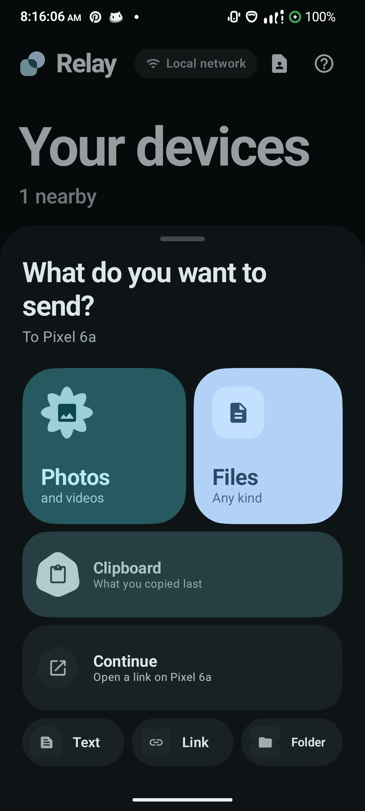
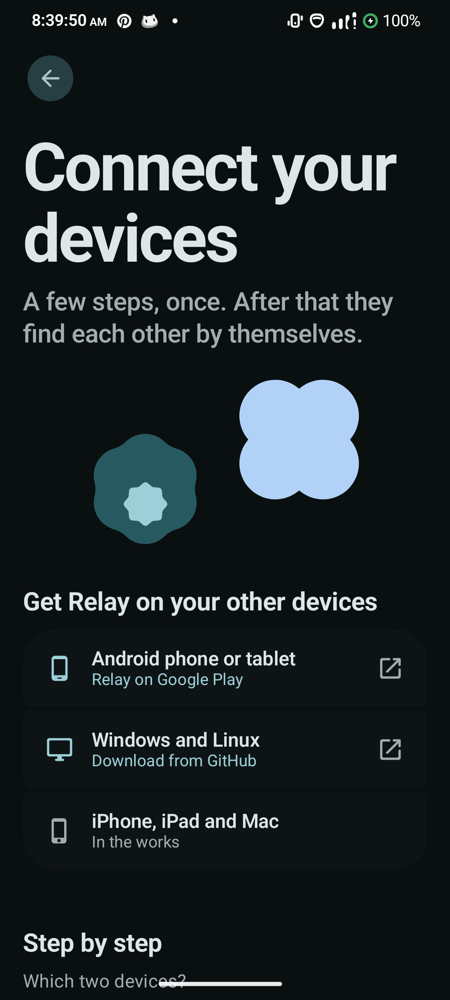

<p align="center">
  
</p>

<p align="center">
  Files, clipboard and links between your phone and your computer.<br>
  Over your own Wi-Fi. No account, no cloud, nothing in the middle.
</p>

---

## What Relay does

- **Universal clipboard.** Copy on one device, paste on another: text, images, whole files.
- **Send anything.** Files, folders, photos, notes and links, from the app or any app's share sheet.
- **Drag and drop to your phone.** On the desktop, drag a file to the shelf at the edge of
  the screen and drop it on a device.
- **Your devices work as one.** Paired devices form an ecosystem: what they send arrives
  straight away, with no Accept prompt, ready to paste.
- **Home-screen widget.** Your devices, one tap from sending.
- **Tap to share contacts.** Hold two Android phones back to back.

Connections are encrypted directly between devices with TLS 1.3. Pairing is confirmed by
checking that both screens show the same three shapes and the same number, so only devices
you approve can reach each other.

<p align="center">
  
</p>

<p align="center">
  
  
  
</p>

## Getting Relay

| Device | Where |
| --- | --- |
| Android 10+ | Google Play, or the APK on the [releases page](../../releases) |
| Windows 10/11 | [Releases](../../releases) — unzip and run `Relay.exe` |
| Linux | [Releases](../../releases) — `.deb` and `.rpm` |
| iPhone, iPad, Mac | In the works |

The desktop builds are not code-signed, so Windows may say the app is unrecognised.
Choose **More info → Run anyway**, or build it yourself with the instructions below.

## Building from source

Requires JDK 17+ and the Android SDK (compileSdk 37).

```bash
./gradlew :app:assembleDebug           # Android
./gradlew :desktop:run                 # desktop app
./gradlew test :app:testDebugUnitTest  # the test suite
./gradlew :desktop:createDistributable -Prelay.packagingJdk=/path/to/jdk17
```

Release builds are signed only when `keystore.properties` exists; without it the release
build is produced unsigned, so anyone can build Relay for themselves.

## How it is put together

| Module | What lives there |
| --- | --- |
| `core:protocol` | The Relay protocol: messages, framing, versions |
| `core:security` | Identities, certificates, pairing codes |
| `core:discovery` | Finding devices on the local network |
| `core:transfer` | The transfer engine: chunks, resume, checksums |
| `core:node` | The engine that ties those together |
| `core:designsystem` | Relay's Material 3 Expressive design system, shared by both apps |
| `core:data` | Android storage: database, settings, files |
| `app` | The Android app |
| `desktop` | The Windows, Linux and macOS app |

The core modules are plain JVM code with no Android or UI dependencies, and are covered by
the test suite.

## Privacy

Relay has no account and no server: what you send goes straight from one of your devices to
another. Optional anonymous usage statistics are off unless you turn them on in Settings.
See [docs/PRIVACY.md](docs/PRIVACY.md).

## Licence

[Apache 2.0](LICENSE).
